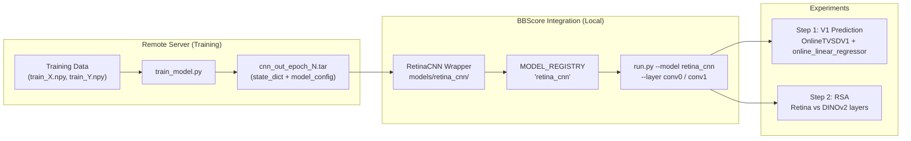

# Retina-BBScore Integration and Experiment Execution Plan

## Architecture Overview

The TVSD benchmark in BBScore provides **static images** (not video frames) to models. Each image is a single RGB PIL Image. The `OnlineFeatureExtractor` handles the forward pass and hook-based feature extraction. The retina CNN, however, expects `(batch, 50, H, W)` -- a 50-frame temporal window of grayscale images. This mismatch is the central design challenge.




---

## Part 0: Train the Retina Model (Remote Server)

### Setup steps on remote server (required before training)

**Step 0.1: Fix the sys.path.insert issue in all three files**

The files `scripts/train_model.py`, `src/Dataset.py`, and `src/misc_util.py` all have this at the very top:

```python
sys.path.insert(0, '../../primate-cnn-model')
```

This path is incorrect. **Remove these lines entirely.** They are unnecessary since the code is already inside the same repo and imports are local.

**Step 0.2: Verify and fix data paths in train_model.py**

Edit `scripts/train_model.py` lines 30-55. Set `dirin` to the correct path to your training data:

```python
# Line 30 -- edit this to your data directory:
dirin = '/path/to/your/primate/retina/training/data'

# Lines 31-33 -- verify these files exist in dirin:
cell_inds_by_type = np.load(os.path.join(dirin, cfg.CELLIDS_DICT_FNAME), allow_pickle=True).item()

# Lines 50-55 -- verify the cell type keys match your data:
cell_inds = np.sort(np.r_[
    cell_inds_by_type['on parasol'],      # <-- confirm these exact keys exist
    cell_inds_by_type['off parasol'],
    cell_inds_by_type['on midget'],
    cell_inds_by_type['off midget']
])
```

If your `cell_inds_by_type.npy` uses different cell type names, update the strings to match. You can check what keys are in the file by running:

```python
import numpy as np
cell_dict = np.load('/path/to/data/cell_inds_by_type.npy', allow_pickle=True).item()
print(cell_dict.keys())
```

Also verify that `dirin` contains the required data files:

- `train_X.npy`, `train_Y.npy`
- `valid_X.npy`, `valid_Y.npy`
- `cell_inds_by_type.npy`

---

### What the three experimental conditions are

The project compares three levels of visual processing as predictors of V1 neural responses:

- **Condition A -- Raw grayscale pixel luminance:** The raw pixel values of each TVSD image, converted to grayscale and flattened. This is the methodological floor: how well can raw light intensity alone predict V1 spiking? It serves as a sanity check -- any meaningful model should beat this.
- **Condition B -- LN (Linear-Nonlinear) retinal model:** The retina model with `enable_layer_0=False` and `enable_layer_1=False`. In this mode, the CNN class degenerates to a single linear projection (the `linear` layer) followed by a softplus nonlinearity. This is the classical Linear-Nonlinear model used in computational neuroscience: a linear spatial filter over the 50-frame input window, followed by a static nonlinearity. It captures linear spatiotemporal filtering but none of the hierarchical nonlinear processing of the full CNN. This is the intermediate control -- it has learned retinal structure but with limited representational capacity.
- **Condition C -- Full CNN retinal model:** The full 3-layer CNN (`enable_layer_0=True`, `enable_layer_1=True`). This adds two convolutional layers with ReLU nonlinearities before the linear readout, enabling it to learn nonlinear spatiotemporal features. The features extracted from `conv0` and `conv1` (before the final linear readout to cells) are what we use as representations for V1 prediction. This is the target model -- we expect it to outperform both A and B.

The comparison A < B < C (in V1 prediction score) would demonstrate that hierarchical nonlinear retinal processing adds predictive value beyond raw luminance, and that the CNN's learned representations generalize to V1.

---

### Training procedure and required adaptations to the pipeline

The existing `scripts/train_model.py` is largely ready to use, but requires a few concrete adaptations:

**1. Data path and cell selection (required edit in `train_model.py`):**

The top section of `train_model.py` (lines 30-55) must be edited for your data:

```python
dirin = '../data'   # <-- change to your actual data directory
cell_inds_by_type = np.load(os.path.join(dirin, cfg.CELLIDS_DICT_FNAME), allow_pickle=True).item()

cell_inds = np.sort(np.r_[
    cell_inds_by_type['on parasol'],
    cell_inds_by_type['off parasol'],
    cell_inds_by_type['on midget'],
    cell_inds_by_type['off midget']
])
```

Verify that the cell type string keys (`'on parasol'`, etc.) match what is actually in your `cell_inds_by_type.npy` file. If your data uses different cell type names, update these strings accordingly.

**2. Training the CNN model (Condition C):**

In `src/config.py`, the defaults are already correct for the full CNN:

```python
enable_layer_0 = True
enable_layer_1 = True
```

No changes needed. Just run:

```bash
cd scripts && python train_model.py
```

This produces `../data/cnn-out/cnn_out_epoch_0.tar` through `cnn_out_epoch_9.tar`. Pick the epoch with the lowest validation loss (`test_cost_cache`) as the best model.

**3. Training the LN model (Condition B):**

Edit `src/config.py` to disable both conv layers:

```python
enable_layer_0 = False
enable_layer_1 = False
linear_L1_reg_lamda = 1e-7   # <-- IMPORTANT: the LN model needs stronger regularization
```

Then run `train_model.py` again, writing to a separate output directory (change `dirout` in the script to avoid overwriting CNN checkpoints):

```python
dirout = os.path.join(dirin, 'ln-out')   # separate output dir
```

**4. The `sys.path.insert` issue (required fix):**

All three source files (`train_model.py`, `Dataset.py`, `misc_util.py`) have a hardcoded path at the top:

```python
sys.path.insert(0, '../../primate-cnn-model')
```

This path is wrong relative to the actual repo location. Before running, either:

- Remove these lines (they are unnecessary since the code is already inside the repo), or
- Change them to `sys.path.insert(0, '..')` or an absolute path

**5. What the checkpoint contains (exact format):**

Each `.tar` file saved by `torch.save(...)` at the end of each epoch contains a Python dict with these exact keys:

```python
{
    'model_config': {                        # Full architecture config dict
        'history_frames': 50,
        'nonlinearity': 'softplus',
        'enable_layer_0': True,              # False for LN model
        'enable_layer_1': True,              # False for LN model
        'layer_0': {'channels': 8, 'kernel_size': 16},
        'layer_1': {'channels': 16, 'kernel_size': 16},
        'stimulus_dim': (y_dim, x_dim),      # e.g. (50, 130) after conv output
        'n_cells': <number of cells>,        # depends on your cell_inds selection
        'learning_rate': 1e-4,
        'conv0_L2_reg_lamda': 1e-5,
        'conv1_L2_reg_lamda': 1e-5,
        'linear_L1_reg_lamda': 1e-5,
        'layer_0_noise': 0.01,
        'layer_1_noise': 0.01,
        'batch_size': 32,
        'output_scale_initialize': <np.array of shape (n_cells,)>,  # per-cell max firing rates
        'device': 'cuda:0'
    },
    'epoch': <int>,
    'train_cost_cache': [...],               # list of per-batch training losses
    'test_cost_cache': [...],                # list of per-batch validation losses
    'reg_cost_cache': [...],                 # list of regularization costs
    'model_state_dict': <OrderedDict>,       # PyTorch state dict -- the actual weights
    'optimizer_state_dict': <dict>,          # Adam optimizer state
}
```

**What to transfer back:** Just the `.tar` checkpoint file(s). The `model_config` inside is everything the BBScore wrapper needs to reconstruct the model architecture and load the weights. No separate config file, no ONNX export, no TorchScript.

Specifically, transfer:

- `cnn_out_epoch_N.tar` (best CNN epoch by validation loss) -- for Condition C
- `ln_out_epoch_N.tar` (best LN epoch by validation loss) -- for Condition B
- Place them in `models/retina_cnn/weights/` in the BBScore repo

**One important note on `stimulus_dim`:** The training data uses 80x160 images, downsampled 2x from the original monitor grid. After `roll_and_crop()`, the spatial dimensions stored in `model_config['stimulus_dim']` are `(y_dim, x_dim)` taken from `train_data.X.shape[2:4]`. This is the spatial size the model expects at inference time. The BBScore wrapper's `preprocess_fn` must resize TVSD images to exactly this size before passing them to the model.

---

## Part 1: BBScore Model Wrapper

Create `models/retina_cnn/` with two files following the existing pattern (e.g., [models/pixel/](models/pixel/)):

### 1a. `models/retina_cnn/__init__.py`

Register three model variants in `MODEL_REGISTRY`:

```python
from models import MODEL_REGISTRY
from .retina_cnn import RetinaCNN

MODEL_REGISTRY["retina_cnn"] = {"class": RetinaCNN, "model_id_mapping": "CNN"}
MODEL_REGISTRY["retina_ln"] = {"class": RetinaCNN, "model_id_mapping": "LN"}
```

Also add `"retina_cnn"` to the `MODEL_MODULES` list in [models/**init**.py](models/__init__.py).

### 1b. `models/retina_cnn/retina_cnn.py`

A wrapper class implementing the BBScore model interface (`get_model`, `preprocess_fn`, `postprocess_fn`). Key design decisions:

**The temporal buffering problem:** The retina CNN expects 50 grayscale frames as input channels, but TVSD provides single static images. The wrapper must handle this. The approach: treat each static image as a single frame replicated 50 times (constant stimulus). This is a reasonable approximation since the TVSD images are static -- the retina model would see a steady-state response to a constant image.

**Model architecture reconstruction:** The wrapper will:

1. Import the `CNN` class from the primate-retina-cnn-model repo (add it as a dependency or copy `src/models.py` and `src/misc_util.py` into the wrapper directory)
2. Load the `.tar` checkpoint
3. Extract `model_config` from the checkpoint to reconstruct the model
4. Load `model_state_dict`

**Wrapper skeleton:**

```python
class RetinaCNN:
    def __init__(self):
        self.static = True  # processes single images
        self.model = None
        self.model_config = None

    def get_model(self, identifier):
        # identifier is "CNN" or "LN"
        # Load the appropriate .tar checkpoint
        checkpoint = torch.load(checkpoint_path, map_location='cpu')
        self.model_config = checkpoint['model_config']
        model = CNN(self.model_config)
        model.load_state_dict(checkpoint['model_state_dict'])
        model.eval()
        self.model = model
        return model

    def preprocess_fn(self, input_data, fps=None):
        # input_data: PIL Image or list of PIL Images (from TVSD dataset)
        # 1. Convert to grayscale
        # 2. Resize to model's stimulus_dim (from model_config)
        # 3. Normalize (divide by 255, subtract mean)
        # 4. Replicate to 50 frames -> (T, history_frames, H, W) or (1, history_frames, H, W)
        # Return tensor of shape (T, 50, H, W) for static model
        ...

    def postprocess_fn(self, features_np):
        batch_size = features_np.shape[0]
        return features_np.reshape(batch_size, -1)
```

**Layer names available for `--layer`:** `conv0`, `batch0`, `conv1`, `batch1`, `linear`. The proposal focuses on `conv0` and `conv1`.

### 1c. Copy model definition files

Copy `src/models.py` and `src/misc_util.py` from the primate-retina-cnn-model repo into `models/retina_cnn/` (renamed to avoid conflicts), so the BBScore repo is self-contained. This avoids cross-repo import path issues.

---

## Part 2: Step 1 -- V1 Prediction Experiments

Three conditions, all using `OnlineTVSDV1` benchmark with `online_linear_regressor` metric:

### Condition A: Raw Grayscale Pixel Luminance (Baseline)

The existing `pixel` model ([models/pixel/pixel.py](models/pixel/pixel.py)) passes images through an `nn.Identity()`. However, it currently uses RGB + ImageNet normalization. We need a **grayscale pixel variant** that:

- Converts to grayscale
- Does not apply ImageNet normalization (just raw luminance)
- Resizes to a consistent size

Options:

- Create a `GrayscalePixel` variant in `models/pixel/` or in `models/retina_cnn/`
- Or modify the existing pixel model with a flag

Command:

```bash
python run.py --model grayscale_pixel --layer identity_layer \
    --benchmark OnlineTVSDV1 --metric online_linear_regressor
```

### Condition B: LN Retinal Model

```bash
python run.py --model retina_ln --layer linear \
    --benchmark OnlineTVSDV1 --metric online_linear_regressor
```

### Condition C: Full CNN Retinal Model

```bash
python run.py --model retina_cnn --layer conv0 \
    --benchmark OnlineTVSDV1 --metric online_linear_regressor

python run.py --model retina_cnn --layer conv1 \
    --benchmark OnlineTVSDV1 --metric online_linear_regressor
```

---

## Part 3: Step 2 -- Retinal-DINOv2 RSA Alignment

This requires comparing RDMs between retina CNN layers and DINOv2 layers on a common grayscale ImageNet stimulus set.

### Approach

BBScore's `rsa` metric ([metrics/rsa.py](metrics/rsa.py)) computes RDMs from `(n_conditions, n_features)` source and `(n_conditions, n_channels)` target matrices. However, the standard pipeline compares a model against neural data, not model-vs-model.

For Step 2, we need a **custom script** (not the standard `run.py` pipeline) that:

1. Loads a grayscale ImageNet subset (e.g., 1000 images from validation set)
2. Extracts features from retina CNN layers (`conv0`, `conv1`) for each image
3. Extracts features from DINOv2 layers (patch embedding, blocks.0 through blocks.5) for each image
4. Computes RDMs for each layer using correlation distance
5. Computes Spearman correlation between RDM upper triangles for all retina-DINOv2 layer pairs

This script goes in `project/step2_rsa_alignment.py` and reuses BBScore's model loading infrastructure but bypasses the benchmark pipeline.

---

## Summary of Files to Create/Modify


| File                              | Action     | Purpose                                                    |
| --------------------------------- | ---------- | ---------------------------------------------------------- |
| `models/retina_cnn/__init__.py`   | Create     | Register retina_cnn and retina_ln in MODEL_REGISTRY        |
| `models/retina_cnn/retina_cnn.py` | Create     | BBScore wrapper (get_model, preprocess_fn, postprocess_fn) |
| `models/retina_cnn/cnn_model.py`  | Create     | Copy of primate-retina-cnn-model `src/models.py`           |
| `models/retina_cnn/misc_util.py`  | Create     | Copy of primate-retina-cnn-model `src/misc_util.py`        |
| `models/retina_cnn/weights/`      | Create dir | Store .tar checkpoint files                                |
| `models/__init__.py`              | Modify     | Add `"retina_cnn"` to MODEL_MODULES list                   |
| `models/pixel/pixel.py`           | Modify     | Add GrayscalePixel variant for Condition A baseline        |
| `models/pixel/__init__.py`        | Modify     | Register grayscale_pixel                                   |
| `project/step2_rsa_alignment.py`  | Create     | Custom RSA comparison script for Step 2                    |


---

## Checkpoint Format Summary (Answer to Your Key Question)

**A `.tar` weights file is sufficient.** The checkpoint saved by `train_model.py` contains both `model_state_dict` AND `model_config` (the full config dict). The config dict has everything needed to reconstruct the model:

- `n_cells`, `stimulus_dim` (architecture shape)
- `history_frames`, kernel sizes, channel counts (layer dimensions)
- `output_scale_initialize` (per-cell parameters)
- `enable_layer_0`, `enable_layer_1` (CNN vs LN)

The wrapper reads `model_config` from the checkpoint, instantiates `CNN(model_config)`, then loads the state dict. No separate config file, no ONNX export, no TorchScript -- just the `.tar` checkpoint.

---

## Execution Order

1. **Train models on remote server** (you do this independently)
2. **Transfer .tar checkpoints** to `models/retina_cnn/weights/`
3. **Implement the wrapper** (Part 1) -- can be done in parallel with training
4. **Test wrapper locally** with a dummy checkpoint to verify the pipeline works
5. **Run Step 1 experiments** (Part 2) -- Conditions A, B, C
6. **Run Step 2 RSA script** (Part 3)
7. **Analyze and visualize results**

---

## Work While Waiting for Training Data

While lab members prepare training data for the primate-retina-cnn-model, work on these todos in order:


| Order | Todo ID            | Description                                   |
| ----- | ------------------ | --------------------------------------------- |
| 1     | `copy-model-files` | Copy models.py, misc_util.py; create weights/ |
| 2     | `create-wrapper`   | Create retina_cnn.py wrapper                  |
| 3     | `register-model`   | Create `__init__.py`, add to MODEL_MODULES    |
| 4     | `grayscale-pixel`  | Create GrayscalePixel for Condition A         |
| 5     | `test-wrapper`     | Test with dummy checkpoint                    |
| 6     | `step2-rsa-script` | Create step2_rsa_alignment.py skeleton        |


**Blocked until checkpoints arrive:** `step1-experiments` (needs CNN + LN checkpoints), `analysis` (needs experiment results).

---

## Appendix: Detailed File Modifications for Remote Server

### File 1: `scripts/train_model.py`

**Lines to remove (at the very top, inside if present):**

```python
sys.path.insert(0, '../../primate-cnn-model/')  # DELETE THIS LINE
```

**Lines 30-55 to edit (set dirin and verify cell keys):**

```python
# OLD:
dirin = '../data'

# NEW (set to your actual data path):
dirin = '/absolute/path/to/training/data'

# Verify cell_inds_by_type.npy exists and contains the expected keys
cell_inds_by_type = np.load(os.path.join(dirin, cfg.CELLIDS_DICT_FNAME), allow_pickle=True).item()

# Update these keys to match your actual cell types if different:
cell_inds = np.sort(np.r_[
    cell_inds_by_type['on parasol'],    # <-- verify these keys exist
    cell_inds_by_type['off parasol'],
    cell_inds_by_type['on midget'],
    cell_inds_by_type['off midget']
])
```

**For Condition B (LN model training) -- add this modification:**

Around line 43, change the output directory:

```python
# For LN training, use a different output folder to avoid overwriting CNN checkpoints:
dirout = os.path.join(dirin, 'ln-out')  # NEW for LN model

# Keep original for CNN:
# dirout = os.path.join(dirin, 'cnn-out')
```

### File 2: `src/config.py`

**For Condition C (CNN) -- no changes needed, defaults are correct:**

```python
enable_layer_0 = True       # keep as-is
enable_layer_1 = True       # keep as-is
linear_L1_reg_lamda = 1e-5  # keep as-is
```

**For Condition B (LN model) -- make these changes:**

```python
enable_layer_0 = False                  # disable conv0
enable_layer_1 = False                  # disable conv1
linear_L1_reg_lamda = 1e-7              # INCREASE regularization (1e-5 -> 1e-7)
```

### File 3: `src/Dataset.py`

**Lines to remove (at the very top):**

```python
sys.path.insert(0, '../../primate-cnn-model')  # DELETE THIS LINE
```

No other changes needed.

### File 4: `src/misc_util.py`

**Lines to remove (at the very top):**

```python
sys.path.insert(0, '../../primate-cnn-model')  # DELETE THIS LINE
```

No other changes needed.

---

## Training Workflow Summary

**Step 1: Train CNN (Condition C)**

1. Verify `config.py` has `enable_layer_0=True`, `enable_layer_1=True`
2. Run: `cd scripts && python train_model.py`
3. Wait for 10 epochs to complete
4. Check `../data/cnn-out/` for checkpoints
5. Find the epoch with lowest mean of `test_cost_cache`
6. Rename that checkpoint to `cnn_out_best.tar`

**Step 2: Train LN (Condition B)**

1. Edit `config.py`: set `enable_layer_0=False`, `enable_layer_1=False`, `linear_L1_reg_lamda=1e-7`
2. Edit `train_model.py` line ~43: change `dirout` to `os.path.join(dirin, 'ln-out')`
3. Run: `cd scripts && python train_model.py`
4. Wait for 10 epochs to complete
5. Check `../data/ln-out/` for checkpoints
6. Find the epoch with lowest mean of `test_cost_cache`
7. Rename that checkpoint to `ln_out_best.tar`

**Step 3: Transfer checkpoints**

1. Copy `cnn_out_best.tar` from `../data/cnn-out/` to the BBScore repo at `models/retina_cnn/weights/cnn_out_best.tar`
2. Copy `ln_out_best.tar` from `../data/ln-out/` to the BBScore repo at `models/retina_cnn/weights/ln_out_best.tar`

You can use `scp`, `rsync`, or any file transfer method. Make sure to create the `models/retina_cnn/weights/` directory in the BBScore repo if it doesn't exist.